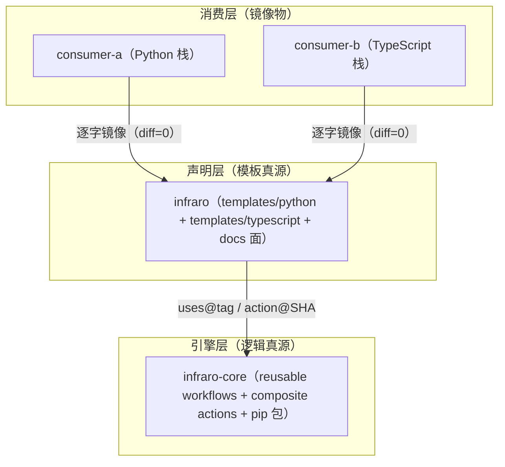

# infraro v3 Delivery Standard（三层交付标准）

本文件是 infraro v3 生态「引擎层 / 声明层 / 消费层」三层交付的权威标准：定义每层交付到什么程度算合格、依赖方向、锚点纪律与机械验收门。与 [Consumer Onboarding](consumer-onboarding.md)（怎么接入）、[Naming Contracts](naming-contracts.md)（命名契约）互补，不重复其内容。

## 1. 三层交付模型总览

### 1.1 层职责与真源边界

| 层 | 仓库 | 可见性 | 职责 | 真源边界 |
| --- | --- | --- | --- | --- |
| 引擎层 | `hdot123/infraro-core` | 公开（匿名访问；消费面经 `hdot123/infraro-core-mirror` 镜像桥，M6.2） | reusable workflows、composite actions、pip 可装引擎包 | 逻辑唯一真源 |
| 声明层 | `hdot123/infraro` | 公开 | 双栈模板 + docs 面 | 模板唯一真源 |
| 消费层 | `hdot123/consumer-a`（Python 栈）/ `hdot123/consumer-b`（TypeScript 栈） | 私有（Pro） | 消费引擎与模板的样板仓 | 镜像物（无模板所有权） |

真源边界规则：

- 引擎逻辑只在 `hdot123/infraro-core` 修改；`hdot123-org/infra-core` 为冻结维护源（见 [Double True Source](double-true-source.md)）。
- 模板只在声明层 `templates/` 修改；消费仓的 workflow 文件是镜像产物，任何改动必须回流声明层模板后重镜像，禁止消费仓本地漂移。
- 消费层样板仓（consumer-a / consumer-b）是 born-complete 出厂形态的定义载体：出厂即与模板逐字镜像（diff=0，见第 5 节验收门）。

### 1.2 依赖方向

依赖方向严格单向：消费层 → 声明层 → 引擎层。下层不得反向引用上层，同层仓之间不得互相引用。



## 2. 引擎层交付标准

### 2.1 发版链（release-please）

引擎发版的唯一通道是 release-please bot 链，禁止手动打 tag、手动发 release：

- `release-as` 钉版用法：需要显式指定目标版本时，通过 release-please 的 release-as 指令钉住本次发版版本号。
- 发完摘除纪律：release-as 指令在本次发版完成后必须摘除，防止后续版本被钉死在同一号位。
- `uv.lock` relock 前置：发版 PR 内依赖变更必须先完成 `uv.lock` relock（pyproject 与锁文件一致）才允许合并，锁滞后视为发版阻塞项。

### 2.2 Tag 命名

版本 tag 遵循 `vMAJOR.MINOR.PATCH`（当前主线 `v0.19.x`，`v0.19.0` = commit `a00de5c`）。所有下游锚点引用该 tag（见 3.2 锚点纪律）。

### 2.3 Ruleset 硬化清单

引擎仓 ruleset 必须满足：

- required status checks = `ci-ok`、`qa-ok`、`droid-review`
- strict 模式（require branches up to date before merging）
- linear history（禁止 merge commit 污染历史）
- squash-only（禁 merge commits / rebase merging）
- admin 无豁免（管理员不可绕过上述任何一项）

### 2.4 测试基线

引擎测试以 `pytest -rA` 运行（输出全部用例结果摘要），CI 不截断失败上下文。

### 2.5 Reusable workflow 契约面

引擎对外暴露的 `workflow_call` 接口契约（caller 侧可见面）：

| reusable workflow | inputs | secrets |
| --- | --- | --- |
| `evolution-scan.yml` | `runner`（JSON 数组串） | `dispatch_token`、`linear_api_key` |
| `evolution-heartbeat.yml` | `runner`（JSON 数组串） | `dispatch_token` |
| `droid-review-shards.yml` | `pr_number`、`head_sha`、`shard_max_files`、`shard_max_count`、`shard_timeout_minutes`、`shard_max_parallel` | `factory_api_key`、`nvidia_kong_proxy_key`、`lumivane_cfat`（双头 BYOM） |
| `auto-merge-pipeline.yml` | — | `dispatch_token` |
| `droid-review-watchdog-handlers.yml` | `mode`、`run_id`、`run_attempt`、`head_sha`、`max_attempt` | — |

补充契约：

- `runner` 输入的 JSON 数组串用法：caller 传字面量数组串（如 `'["self-hosted","pve-linux"]'`），引擎侧 `fromJSON` 解析为 `runs-on` labels。禁止向该输入传空串——空串会使 `fromJSON` 失败。
- schedule 事件空 inputs 的兜底语义：`schedule`（及 `pull_request_target`）触发不提供 dispatch inputs，`inputs` 上下文为空。caller 凡转发 `inputs.*` 的位置必须带 `|| 默认值` 兜底或改用字面量（droid-review caller 的 `shard_* || '25'` 系即此加固，消费仓 PR #7 实证：不兜底会向 callee 传空串导致 `fromJSON` 失败）。
- `scanner_workflow` 输入缺省即契约名 `evolution-scan.yml`（文件名不同的消费仓可传该输入覆盖）；模板保持不传该输入，消费仓必须保持契约文件名 `evolution-scan.yml` / `evolution-heartbeat.yml`（见 3.2）。

### 2.6 Composite action 契约面

引擎 composite actions（`governance-check`、`branch-cleanup`、`droid-review-aggregate` 等）由消费仓以不可变 commit SHA + tag 注释形式引用（如 `@3695445b… # v0.18.5 pin`）。SHA 锚不随 tag 浮动，升级走声明层模板变更流程（见 3.3）。

## 3. 声明层交付标准

### 3.1 双栈模板清单

`templates/python/` 与 `templates/typescript/` 同构，每栈 7 件 workflow 模板：

| 文件 | 形态 | 锚点形态 |
| --- | --- | --- |
| `evolution-scan.yml` | thin-caller | `uses@v0.19.0` |
| `evolution-heartbeat.yml` | thin-caller | `uses@v0.19.0` |
| `droid-review.yml` | thin-caller（分片流水线委托引擎，聚合 job 留本地） | reusable `@v0.19.0` + 聚合 action SHA pin |
| `droid-review-watchdog.yml` | thin-caller（双 handler 委托 + 本地 quota-sweep） | `uses@v0.19.0` |
| `auto-merge.yml` | thin-caller | `uses@v0.19.0` |
| `governance.yml` | copy-form（provenance header） | composite action SHA pin |
| `branch-cleanup.yml` | copy-form（provenance header） | composite action SHA pin |

支撑件（随栈交付）：

| 文件 | 职责 |
| --- | --- |
| `.github/workflows/ci.yml` | 消费仓 CI 主工作流（结构不变量见 4.2） |
| `.evolution/config.yml` | evolution 配置（含 `engine_ref: v0.19.0` 锚） |
| `.evolution/suppress.json` | 抑制清单（出厂为空 `suppressions: []`） |
| `.github/actionlint.yaml` | actionlint 的 self-hosted-runner labels 声明 |
| `.github/review/shard-review-prompt.md` | 分片 review prompt（JSON 输出契约 + 预算约束） |
| `watchdog.yml` | watchdog handler 的 `workflow_call` 包装 |

### 3.2 锚点纪律

- 单一 tag：同一交付周期内，全部 reusable workflow 引用统一锚同一引擎 tag（当前 `v0.19.0`）；有效锚点（`uses@tag` 与 `engine_ref`）经 grep 只允许出现一个版本号。
- 禁 `@main` 浮动引用（INFRA-651）；禁跨版本混锚。
- copy-form 模板的 provenance header（source / tag / commit / date）是历史记录，不属于有效锚点；其 composite action 走不可变 SHA pin。
- 文件名契约（载荷文件名，字节级固定）：`evolution-scan.yml`（心跳引擎按 `SCANNER_WORKFLOW` 经 `gh run list --workflow` 探活并 `gh workflow run` 自愈拉起）、`evolution-heartbeat.yml`（扫描器反向探活，INFRA-588）、`droid-review-watchdog.yml`（workflow 名 `Droid Review Watchdog`，其 `workflow_run` 监听名数组字节级匹配兄弟 workflow 名）。
- workflow 名与 job key 契约见 [Naming Contracts](naming-contracts.md)：workflow 名 `CI`、聚合 job key `ci-ok` / `qa-ok`、gate 前缀 `gate/*`。

### 3.3 模板变更流程

1. 声明层修改模板（模板唯一修改点）。
2. 如需引擎配套能力，先走引擎发版链（2.1）出新 tag。
3. 消费仓从模板重镜像（逐字复制，含支撑件）。
4. diff=0 验收：模板栈目录与消费仓对应文件逐一比对为零差异。
5. 三仓 PR 链：引擎 PR（如需）→ 声明层 PR → 消费仓 PR；每环独立 PR、检查全绿后 squash 合并，任何一环不允许 `--admin` 绕过。

### 3.4 Docs 面最小集

声明仓 docs 面最小集：`getting-started`、`consumer-onboarding`、`naming-contracts`、`per-repo-baseline`、`base-layer-templates`、`boundary-capabilities`、`double-true-source`、`BOUNDARY`，辅以 `runner-registration-runbook`、`substrate-map` 与本文件。docs 间互相链接、不重复表述。

## 4. 消费层 born-complete 标准

### 4.1 出厂件清单

消费仓出厂 = 声明层对应栈模板的逐字镜像：7 件 workflow + 支撑件（`ci.yml`、`.evolution/config.yml`、`suppress.json`、`actionlint.yaml`、`shard-review-prompt.md`、`watchdog.yml`）。镜像即验收：任一出厂件与模板 diff=0。

### 4.2 CI 结构不变量

`ci.yml` 以下结构为不变量（改动需回流声明层）：

- workflow `name: CI` 恒定（auto-merge / watchdog 的 `workflow_run` 监听按名过滤）。
- 四槽位常规测试（hosted）：`test` / `lint` / `typecheck` / `guards`。
- `ci-ok` 聚合门：`needs` 四槽位 + `if: always()`；轮询 `droid-review` check-run 至收敛（约 5 分钟上限）；bootstrap 感知——当 PR 自身修改 droid-review caller 时，比对 base/head caller blob SHA，不同则以 marker 放行（`pull_request_target` 取 BASE 定义所致的已知窗口）。
- `notify` 腿：`notify-ci-complete`，`if: always() && github.event_name == 'pull_request'`。
- 顶层 `concurrency`：`ci-${{ github.workflow }}-${{ github.ref }}`，仅 PR 事件 `cancel-in-progress`。
- workspace guard：`test` 槽位首步检测 sparse/prune 残留并清除 `.git` 触发干净重克隆。
- 显式最小权限 baseline：`contents: read`、`checks: read`。

### 4.3 Secrets 五件与注入形态

| secret | 用途 | 注入形态 |
| --- | --- | --- |
| `FACTORY_API_KEY` | droid-review 分片流水线 | snake 转发 `factory_api_key` |
| `OPENCODE_GO_KEY` | droid-review 分片流水线（BYOM Authorization 透传） | snake 转发 `opencode_go_key`；OpenCode Go 订阅 key，由客户端 Authorization 携带（custom provider 不做 BYOK 注入） |
| `GO_GITHUB_RUN_TOKEN` | droid-review 分片流水线（CF AI Gateway 认证） | snake 转发 `go_github_run_token`；`cf-aig-authorization: Bearer <...>` header。任何文档/模板不落 key 值 |
| `DISPATCH_TOKEN` | scan / heartbeat / auto-merge / branch-cleanup | snake 转发 `dispatch_token` |
| `LINEAR_API_KEY` | scan / branch-cleanup | snake 转发 `linear_api_key` |

secrets 传参为 snake-only 单形态（SNAKE-CONVERGENCE），禁止连字符形态。

### 4.4 Ruleset 后置顺序

坑 10（后置顺序）：先让 CI workflow 实际跑出 `ci-ok` check-run，再把 `ci-ok` 挂为 required status check。顺序颠倒时 required check 无历史记录，PR 会被判定缺失必需检查而永久无法满足。消费仓 required = `ci-ok`。

### 4.5 Runner 注册

- 逐仓注册：`./config.sh --url https://github.com/hdot123/<repo-name> --token <RUNNER_TOKEN>`。
- labels 固定：`self-hosted`、`pve-linux`（与 `actionlint.yaml` 声明一致）。
- 分工：常规测试槽（`test` / `lint` / `typecheck` / `guards` / `ci-ok` / `notify`）走 GitHub-hosted `ubuntu-latest`；重负载槽（`droid-review` 聚合发布、`governance`、`scan`、`heartbeat`、quota-sweep）走自建 runner。

### 4.6 重负载槽语义

重负载槽的 runner 选择经 `runner` 输入以 JSON 数组串传入（`'["self-hosted","pve-linux"]'`），引擎侧 `fromJSON` 解析为 labels（见 2.5 兜底语义）；本地 job 直接声明 `runs-on: [self-hosted, pve-linux]`。

## 5. 验收门（机械清单）

三层交付的收口验收，逐项机械可查：

| # | 验收项 | 判定形态 |
| --- | --- | --- |
| 1 | diff=0 | 模板栈目录 vs 消费仓镜像文件逐一比对，零差异 |
| 2 | pin 单一 grep | 对有效锚点（`uses@tag`、`engine_ref`）grep 只出现一个引擎版本号 |
| 3 | PR 全绿 squash | 三仓 PR 检查全绿后 squash 合并；全程无 `--admin` |
| 4 | main run success 回读 | 合并后回读 main 分支最新 run 为 success |
| 5 | 匿名 install 实测 | 无 token 执行 `pip install git+https://github.com/hdot123/infraro-core-mirror.git@v0.19.0` 成功 |
| 6 | droid-review 真跑 | review 有实际审查轮次（非 0-turn 空跑），聚合 check `droid-review` 为 success |
| 7 | 三槽位 runner 证据 | `scan` / `heartbeat` / `governance` 的 run 落在自建 runner（`runner_name=ce-01` 证据回读） |
| 8 | dispatch 白名单负证 | 从非白名单 head 手动 `workflow_dispatch` → run 呈 skipped / fail-closed 形态（E1-5 守卫生效） |

## 6. 已知边界与豁免

- `DISPATCH_TOKEN` PAT 私有仓 scope：heartbeat 自愈与扫描器反向拉起均经 `gh workflow run` 打到私有消费仓，PAT 必须覆盖目标私有仓的 workflow 触发权限——这是自愈面的已知信任边界。
- dispatch 守卫 `contains()` 语义：守卫条件为字面子串匹配，形如：

  ```yaml
  if: |
    github.event_name != 'workflow_dispatch' ||
    contains('refs/heads/main|refs/heads/hotfix/*|refs/heads/feature/*', github.ref)
  ```

  通配段 `hotfix/*` / `feature/*` 不参与匹配，有效白名单 = `main`；非白名单 head 的手动 dispatch fail-closed。
- gate-suite advisory 形态：gate 套件当前以 advisory（不阻断合并）形态运行，不进入 required checks。
- engine 转私 runbook：引擎转私有仓的迁移动作手册已存在，仅在迁移终验通过后执行；当前「引擎公开 + 匿名访问」是交付基线（见 [BOUNDARY](BOUNDARY.md)）。

## 7. 相关文档

- [Getting Started](getting-started.md)
- [Consumer Onboarding](consumer-onboarding.md)
- [Naming Contracts](naming-contracts.md)
- [Per-Repository Baseline](per-repo-baseline.md)
- [Base Layer Templates](base-layer-templates.md)
- [Boundary Capabilities](boundary-capabilities.md)
- [Double True Source](double-true-source.md)
- [BOUNDARY](BOUNDARY.md)
